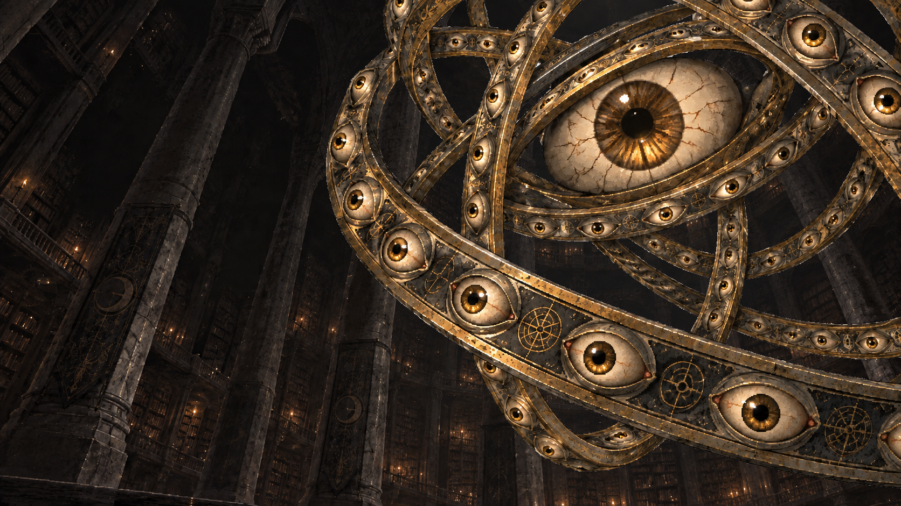

# 서고 재설계와 전투 레이어

기존 게임을 참고하며 새 방향을 검토하는 작업 폴더입니다. 게임의 실제 씬에 적용하기 전의 시안이며, 타일 및 최종 도트 에셋은 아직 제작하지 않았습니다.

## 전투 이미지



- `watcher-battle-v1.png`: 사용자가 선택한 원래 전투 구도.
- `battle-background-v1.png`: 그것과 등불을 제거하고 빈 공간을 채운 도서관 배경.
- `watcher-foreground.png`: **실제 알파 투명도가 있는** 그것의 PNG. 고리 사이도 투명합니다.
- `battle-layered-preview.png`: 배경과 그것을 합친 정지 미리보기.
- `preview.html`: 내려받은 폴더에서 브라우저로 열면 배경은 고정되고 그것만 위아래로 움직입니다. 화면 가장자리 절단면이 드러나지 않도록 그것을 2.5% 확대했습니다. 운영체제의 움직임 줄이기 설정을 따릅니다.
- `watcher-alpha-check.png`: 투명 영역을 단색 배경 위에서 확인하는 검수 이미지.

배경과 전경은 1672 × 941 캔버스를 공유합니다. 전경을 추출하는 이미지 생성 단계에서 세부 묘사가 원본과 조금 달라졌습니다. 이후 체크무늬 제거 단계는 남긴 픽셀의 RGB를 바꾸지 않고 알파만 수정했습니다. 전경의 투명 픽셀은 939,571개이며, 그것 전체가 현재 하나의 레이어입니다. 부위 파괴를 위한 개별 부품 분리는 아직 하지 않았습니다.

`watcher-foreground-draft.png`는 체크무늬가 실제로 그려진 실패 중간본입니다. 게임에 사용할 파일은 `watcher-foreground.png`입니다. 제거 과정을 다시 실행하려면 Windows PowerShell에서 다음 명령을 사용합니다.

```powershell
powershell.exe -NoProfile -ExecutionPolicy Bypass -File .\remove-checkerboard.ps1
```

## 이어갈 방향

- 탑뷰 탐색, 턴제 전투, 스토리 중심. 어둡고 미스터리한 코즈믹 호러.
- 서고는 세계관에 몰입하는 튜토리얼. 먼지 쌓인 책과 가구는 남아 있지만 사람은 없는 거대한 실내 홀.
- 무너진 기둥과 부서진 서가가 탐색을 유도하되, 과도하게 반복되는 지그재그 통로는 피함.
- 읽을거리는 자유로운 순서로 탐색. 모두 읽으면 열리는 장치를 둠. 장치의 구체적인 형태는 미정.
- 홀 저편의 그것은 눈으로 뒤덮인 고리 형태. 날개와 깃털은 없음.
- 전투에서는 오른쪽에 거대한 적, 왼쪽 등불의 빛으로 구성된 UI. 거대한 적의 전투 구도는 로우앵글.
- 부위 파괴 시스템을 도입하고 싶다는 방향은 합의했으며 구체적인 규칙은 미정.

`archive-concept-v1.png`는 분위기 시안, `archive-topdown-v1.png`는 탐색 화면 시안입니다. 후자는 실제 구현에 필요한 정확한 탑뷰 설계도는 아닙니다. `floorplan-v3-fragment.html`은 대화 속 평면도 시각화 원본 조각이며 호스트 스타일이 필요합니다.

추가 기록은 [방향과 스프라이트 QA](방향과_스프라이트_QA.md)에 있습니다. 기록이 충돌할 때는 위의 최신 방향을 우선합니다. 방랑자 이미지는 검토 중인 초안이며 사용자 요청에 따라 캐릭터 작업은 중단한 상태입니다. `*-prompt.txt`는 생성 의도를 정리한 요약문이며 정확한 원문 프롬프트 기록은 아닙니다.
